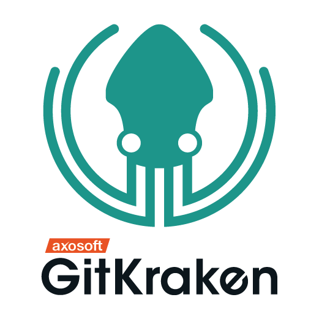
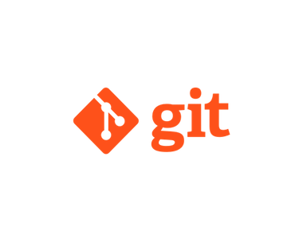
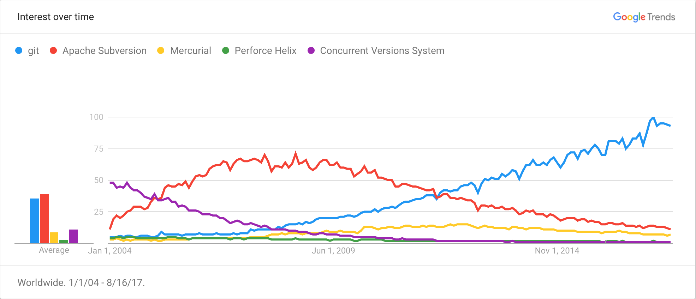

---
 
### Before our journey, you might want to get these stuffs

---

### Have you ever wanted to..
- Revert a change after making a mistake?  |
- Know what a person changed, where and when?  |
- See differences in versions of a file?  |
- Go explore a new idea but still be able to go back?  |
- Not lose your work when someone overwrites?  |
- Restore from a backup 15 minutes ago?  |

+++

### What about..
- Collaborate on a single document seamlessly while offline?  |
- Needed to maintain multiple versions?  |
- Prove that a change broke or fixed some code?  |
- Know what decisions led to the introduction of a feature?  |
- Isolate the staged changes to be moved into your production server?  |

---?image=assets/gitkraken-graph.png&size=100% auto

<h3 style="text-align:left;margin-left:55%">What is Git?</h3>

Version Control Software  (VCS)

<ul style="text-align:left;margin-left:48%">
    <li>What changed</li>  <!-- .element: class="fragment" -->
    <li>When it changed</li>  <!-- .element: class="fragment" -->
    <li>Who changed it</li>  <!-- .element: class="fragment" -->
</ul>

---

### What about other VCS?

Other VCS may work <em2>better</em2> for..
- binary files
- large repositories
- images

+++

<h3 style="color:white"><em2>Git</em2> is best for text files (<em2>code</em2>)</h3>

and by far the [most used](https://trends.google.com/trends/explore?date=all&q=%2Fm%2F05vqwg,%2Fm%2F012ct9,%2Fm%2F08441_,%2Fm%2F08w6d6,%2Fm%2F09d6g&hl=en-US) VCS overall  

+++

### Simply because....
<ul>
    <li>It's <em2>Distributed.</em2></li>  <!-- .element: class="fragment" -->
    <li>It's Fast</li>  <!-- .element: class="fragment" -->
    <li>Powerful <em2>branching</em2></li>  <!-- .element: class="fragment" -->
    <li>Lets the developer work how he wants to</li>  <!-- .element: class="fragment" -->
    <li>Powerful <em2>staging environments</em2></li>  <!-- .element: class="fragment" -->
</ul>

Note:
With Git each person that works on a project has their own copy of the whole history of the project
(natural backup mechanism, offline, work on same document at the same time, most operations are done offline)

Because of that, it's fast. very fast in terms of VCS. Git also only tracks the changes that happen to files instead of whole copies of files

When do you share a word doc with someone? usually when you're at a good stopping point right? Let's say I'm working on a new version of code or an essay, or whatever. typically, start.. idea.. grammar error.. or dangit this guy misspelled this company's name throughout the whole document! 
soon I have this just lump of 5 unfinished branches of work and ideas and I have to finish them all before I can send the document to someone.
Git's staging environment lets break up all those ideas after we decide it's time to touch base. and we can push ONLY the changes we decide are finish over to the rest of the team and continue working on our other ideas locally.

That's another thing Git does well. Git allows you to branch off and go play around with a new idea or feature seamlessly. This also allows for powerful collaboration without stepping on other developers' toes, and we'll get into more of that later.

---

##  Github
  
The <em2>home</em2> for Open Source

+++

### Open Community

- The largest open source community  |
<li>[Trusted](https://github.com/nasa/kepler-pipeline)</li>  <!-- .element: class="fragment" -->
- Welcoming  |  

Note: 
64+ million open source projects, 23+ million users

Google, Adobe, Twitter, Paypal, AWS, Yahoo, LinkedIn, Facebook, Dropbox, Mozilla (everything they do is on github: https://github.com/mozilla/bedrock/), NASA (kepler: https://github.com/nasa/kepler-pipeline)

They recognize that project activity is mostly voluntary. They recognize that they need to provide an easy learning environment. and they recognize that creating something together is fun and inspiring.  

---

The Text Editor

